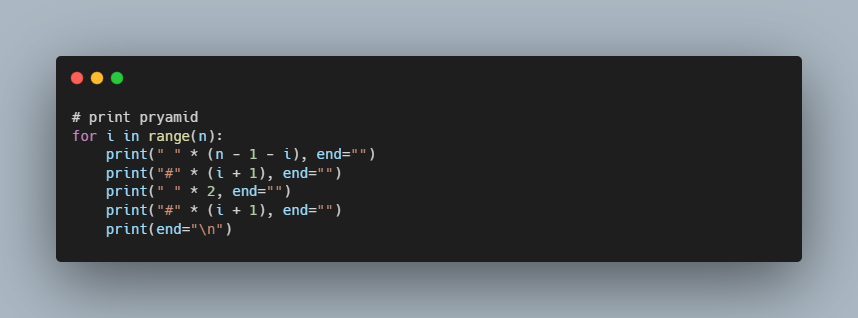

# Mario More - CS50

### Description

A program that prints out a double half-pyramid of a specified height

### How to use

python mario.py
Enter height: 4

       #  #
      ##  ##
     ###  ###
    ####  ####
   #####  #####
  ######  ######
 #######  #######
########  ########

### Code Snippet

### Links

For more information about Filter-more visit: 

---------------------------------
[cs50 course](https://cs50.harvard.edu/x/2022/psets/6/mario/more/)
---------------------------------------------------------------

